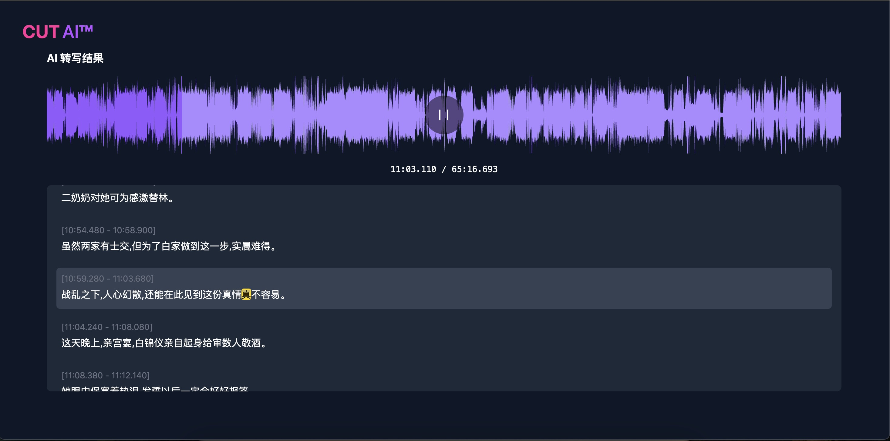

# cut.ai

[Read in English](README.en.md)

cut.ai 是一个AI音视频剪辑工具，语音转写基于whisper




## 功能列表

- [x] **语音转写**: 基于 Whisper 的高精度语音识别。
- [x] **波形播放器**: 使用 `wavesurfer.js` 提供现代化的音频波形可视化播放器。
- [x] **文本同步高亮**: 音频播放时，转写文本会进行短语和字词双重高亮，并自动平滑滚动，确保焦点始终可见。
- [x] **点击跳转**: 支持点击转写文本的任意位置，音频即可跳转到对应时间点播放。
- [x] **在线编辑**: 支持直接在页面上修改转写结果，并保存到服务器。
- [ ] 内容摘要总结
- [ ] 字幕剪辑
- [ ] 章节速览
- [ ] 精彩片段剪辑

## 环境安装

### 后端 (Server)

运行环境：python 3.10、redis
配置文件：`config.yaml`

``` shell
pip install -r server/requirements.txt
```

### 前端 (Web)

运行环境：Node.js, pnpm

```shell
cd www/web
pnpm install
```

## 运行

### Server

分别在两个终端中执行：
``` shell
# 启动 FastAPI 服务
uvicorn main:app --reload --host 0.0.0.0 --port 5010
```

``` shell
# 启动 Celery worker
celery -A celery_config worker --loglevel=info --concurrency=4 
```

### docker

``` shell
docker run -d --rm --gpus all -p 5010:5010 --name cut.ai-server -e "REDIS_HOST=192.168.4.9" -e "REDIS_PORT=6379" -e "REDIS_PASSWORD=lidedongsn" cut.ai-server:latest 
```

### Web
修改 `www/web/.env.development`文件中实际的 server 地址，并运行
`VITE_BASE_URL='http://localhost:5010'`

``` shell
cd www/web
pnpm run dev
```
浏览器打开 http://localhost:3000